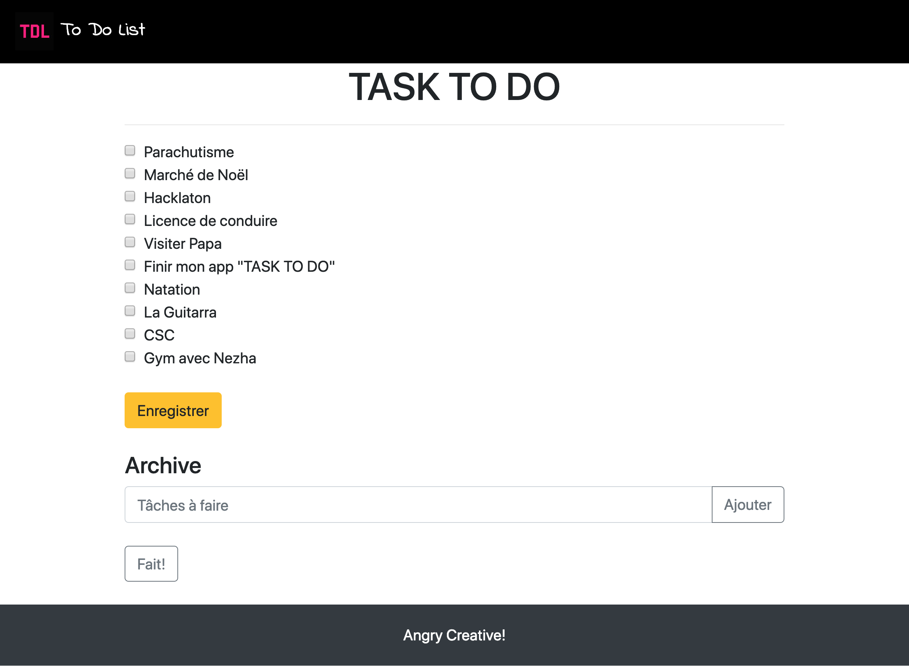

# To-do list + SQL, en php

## Parametres
**repository :** `todolist-sql`  

**Dev:** Meilyn Andrade

**Où:** BeCode [Junior Web Developper]

**Status:** En progression

**Quand:** Mars 2019

## Projet

Crée un outil de gestion de tâches basique et fiable. L'interface est subdivisée en deux parties :

partie supérieure : la liste des tâches à faire, avec pour chaque tâche, une checkbox. Lorsqu'une tâche est effectuée, on coche la tâche puis on appuye sur un bouton "Enregistrer" qui rafraichit la liste en barrant la tâche terminée et en la mettant dans la zone "archivée".

partie inférieure : un petit formulaire permettant d'ajouter une tâche (un champ "textarea" et le bouton "submit").

Mon App avances: 

- [x] Possibilitée de créer des tâches :+1:
- [ ] Archive
- [ ] Bonus

